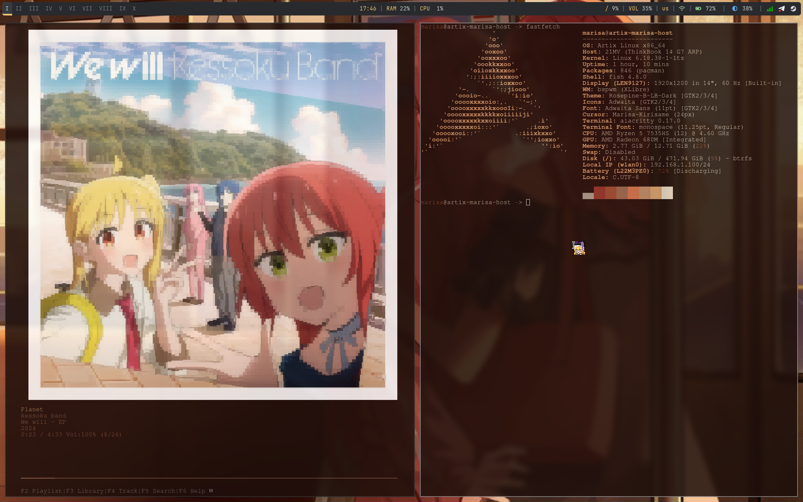

# bspwm

<h1 align="left">📘 About</h1> 

* **OS:** [Artix Linux](https://artixlinux.org)
* **WM:** [BSPWM](https://github.com)
* **Bar:** [Polybar](https://github.com)
* **Compositor:** [Picom](https://github.com)
* **Terminal:** [Alacritty](https://github.com)
* **App Launcher:** [Rofi](https://github.com)
* **Shell:** [Fish](https://github.com)

 

<!-- IMAGES -->
# Gallery

